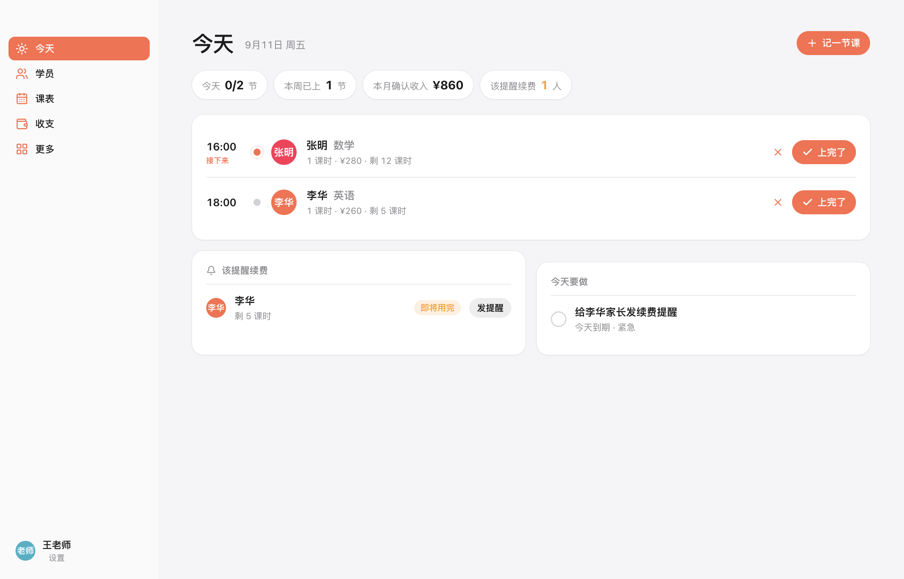
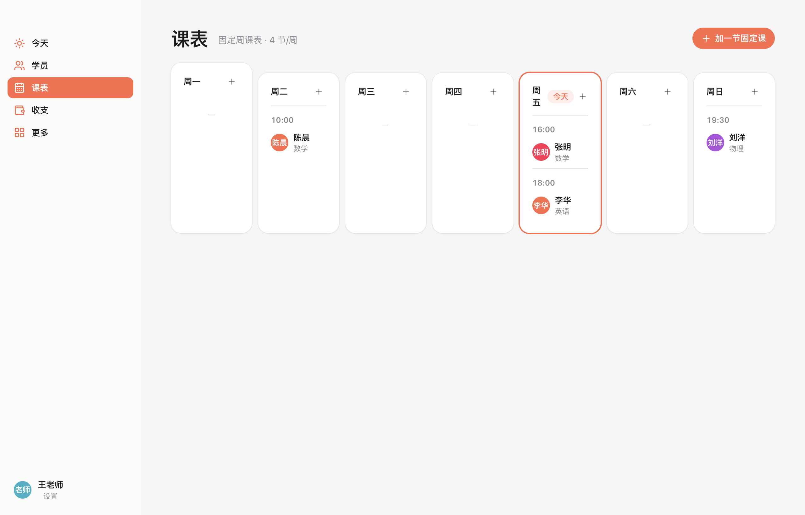
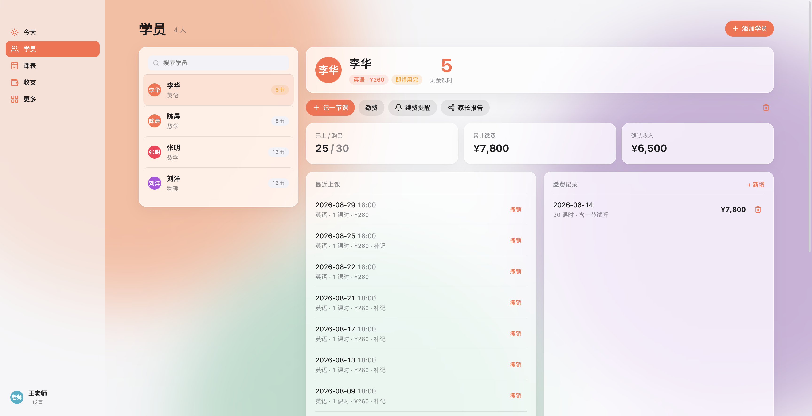
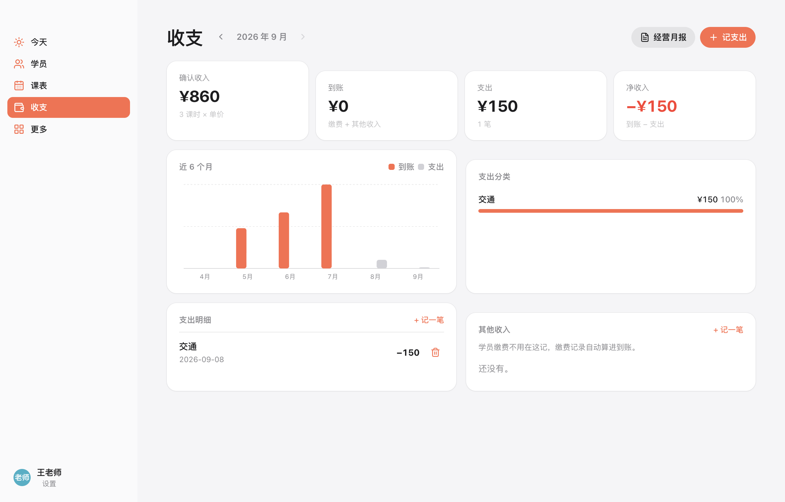
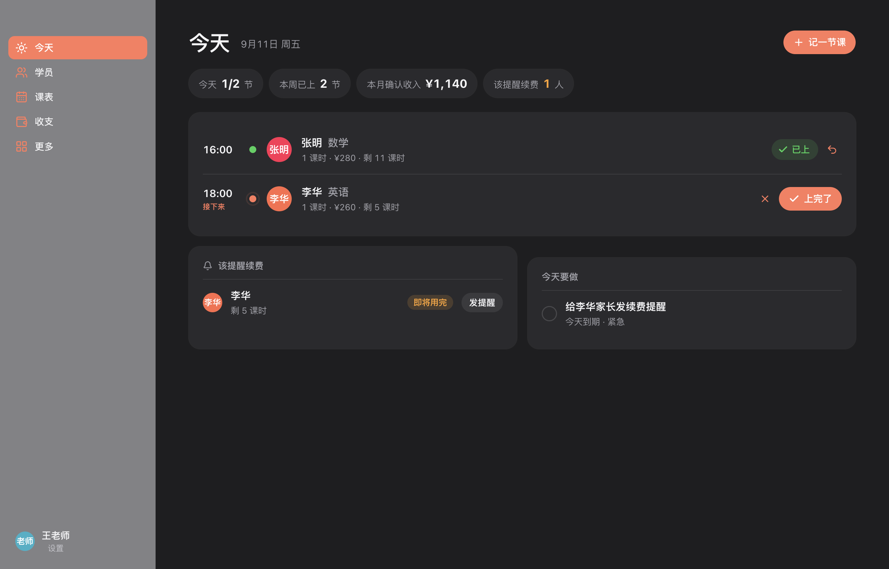

# 记一课 · Lesson Log

**给独立老师的 macOS 工作台，把排课、上课、课时、缴费和日常经营记在一起。**

今天要给谁上课、还剩多少课时、该提醒谁续费、这个月实际收了多少钱，都可以在这里查看。一对一和小班课都能记录，也能管理合作老师的授课与课时费。

开源免费，中文界面，无需注册账号。日常数据保存在自己的电脑上，断网也能使用。

[下载 macOS 安装包](https://github.com/timjinlun/tutor-workspace/releases/latest) · [反馈问题或建议](https://github.com/timjinlun/tutor-workspace/issues)

<p align="center"></p>

## 下载与安装

1. 打开 [下载页面](https://github.com/timjinlun/tutor-workspace/releases/latest)，展开 **Assets**。
2. M 系列芯片的 Mac 选择文件名带 **arm64** 的 `.dmg`；Intel Mac 选择 **x64**。不确定时，可在苹果菜单的「关于本机」中查看。
3. 打开安装包，把「记一课」拖入「应用程序」，再打开应用。

目前提供 macOS 桌面版，尚无 iPhone、iPad、Windows 安装包，也没有跨设备自动同步。

安装包尚未经过 Apple 开发者签名和公证。首次打开若被系统阻止，可在尝试打开后前往「系统设置 → 隐私与安全」，查看是否有「仍要打开」选项。若提示「已损坏」，确认安装包来自上面的本项目发布页后，可在终端执行以下命令，移除这个应用的下载隔离标记，再重新打开：

```bash
xattr -dr com.apple.quarantine /Applications/记一课.app
```

下文主要介绍已发布的 **v3.5.3**；尚未发布的学员档案和教学管理更新另列在文末。截图仅供了解布局，具体界面以安装版本为准。

## 第一次使用

1. **设置自己的习惯。** 在「设置」填写老师称呼，调整剩余课时提醒门槛。
2. **建立课程。** 在「课程」中填写课程名称、每课时单价、每节扣几课时，以及一课时多少分钟。
3. **添加学员与缴费。** 为学员选择课程，记入已购买的课时、实收金额和缴费日期。
4. **安排课程。** 每周固定上课就添加固定课表；临时约课可直接在课表中安排，也可以上完后「记一节课」。
5. **上完就打卡。** 在「今天」点「上完了」，课时余额、上课记录和授课收入随之更新。

想先试用，可以在「设置」载入示例数据。**示例数据会覆盖当前记录**，已有真实数据时请先导出备份。

## 每天上课：看安排、记课、处理变动

### 今天

打开应用就能看到当天的课程，包含学员或班级、时间和完成状态。

- **固定课自动出现：** 每周重复的课程不用每天重填。
- **上完一键记录：** 打卡后扣除对应课时，累计授课收入；班课可先点名再统一打卡。
- **临时上课也能记：** 点击「记一节课」，选择学员，带出课程与单价。
- **漏记提示：** 根据历史上课规律提示可能遗漏的课，由你确认后记入。
- **当天不上可取消：** 已打卡的课若记错，可以在确认后撤销，相应课时和收入会同步回退。
- **续费与待办放在一起：** 查看课时不足的学员、到期事项，并勾选完成待办。

### 课表

按自己的习惯切换视图：

| 视图 | 适合做什么 |
|---|---|
| 一周 / 两周 | 在时间网格里查看近期安排，点空白处排课 |
| 月历 | 查看整月分布，点某一天查看当天课程 |
| 按学员 | 对照学员查看考勤情况 |

点击课块可打卡、取消或改期；固定课表集中管理，可以暂停。课程按课时长度计算结束时间，合作老师的课程用不同颜色区分。

<p align="center"></p>

## 学员、课时与续费

每位学员都有自己的档案，集中查看所学课程、上课历史、已购课时、已用课时、剩余课时和缴费记录。

- **整理名单：** 按姓名搜索、手动拖拽排序，或按课时余额排序。
- **记录缴费：** 填写购买课时、金额、日期和备注，金额可以按实际收款填写。
- **查上课历史：** 按月份查看记录，核对上课日期、课时与扣费。
- **保留结课记录：** 已结课学员收进折叠名单，需要时可恢复。
- **提前提醒续费：** 自定义剩余多少课时提醒、再提前几节预警，复制提醒文字后自行发给家长。
- **生成家长月报：** 汇总当月上课记录、累计与剩余课时，并可填写老师寄语，复制后用于沟通。

记一课不会自动向家长发送消息，复制的报告和提醒由你检查后发送。

<p align="center"></p>

## 课程、小班与合作老师

### 课程规则自己定

每门课可以设置单价、每节扣几课时，以及一课时对应的分钟数。既可以沿用统一时长，也可以为某门课程单独设置。

例如：一课时 45 分钟，一次上 2 课时，就按 90 分钟安排，完成后扣 2 课时。

### 小班课一起点名，分别记账

创建班级，选择课程、成员和授课老师，设置本班单价，以及缺席是否扣课时。当天一张班课卡片就能完成点名和打卡，各学员分别扣除自己的课时。

收工统计按实际教学场次计算：3 位学员一起上了 2 课时，显示 **1 节课、2 课时**，不会算成老师上了 3 节课。

### 合作老师课时费

添加合作老师，设置专属颜色和每课时费用，排课时指定由谁授课。在「收支」中按老师查看上课量、学费收入和应结课时费，确认后可记为一笔支出。

这里记录的是结算账目，不会自动向老师转账，也不提供多人在线协作。

## 收支：上了多少课，实际收了多少钱

「收支」按月份汇总，并提供近 6 个月的到账与支出对比、支出分类及明细。

| 页面数字 | 表示什么 |
|---|---|
| 确认收入 | 已完成课程按课时和单价核算的授课收入 |
| 到账 | 该月记录的学员缴费与其他收入 |
| 支出 | 该月记录的各类支出 |
| 净收入 | 到账减去支出 |

例如：家长一次缴了 2,000 元，本月完成的课程按单价核算为 600 元，这笔缴费计入到账，已上课程计入确认收入，两者分别统计。

可以手动记录支出和其他收入，查看老师课时费，并生成可复制的经营月报，回顾本月课时、活跃学员、收支及需要续费的学员。

<p align="center"></p>

## 看见自己的教学积累

### 储蓄罐与收工海报

完成课程后，金币动画呈现本月授课收入的积累；撤销记录时相应扣回。可以在设置中调整储蓄罐的目标金额。

当天至少完成一节课、没有待上课程时，时间轴下方会出现「收工」。收工卡展示实际完成的课数、课时和鼓励语，也可以生成 **1080 × 1350 PNG 海报**。

- 默认隐藏收入，开启「显示今日收入」后展示今日授课核算金额。
- 收工海报不展示学员姓名和课程明细。
- 可保存到电脑，或用同一 Wi-Fi 下的手机扫码打开图片并长按保存。
- 传图二维码 60 秒后失效，关闭卡片或退出应用也会停止传图；过期后可重新生成。

扫码传图只在局域网内临时分享当前海报，不上传云端。若手机无法连接，检查两台设备是否处于同一 Wi-Fi，以及访客网络隔离或防火墙设置；也可以直接保存到电脑。

### 月度成绩卡

在「更多 → 成绩卡」选择月份，生成一张记录自己教学工作的图片，包含上课次数、课时、学员数量与确认收入，保存后可用于朋友圈或小红书分享。

成绩卡为 **1080 × 1350 PNG**。它与收工海报不同，会展示收入，也可能展示最勤奋学员的姓名，分享前请检查预览。

## 招生咨询、教学资料与转介绍

这些辅助功能放在「更多」中：

| 功能 | 可以做什么 |
|---|---|
| 潜在学员 | 记录称呼、联系方式、咨询来源、意向金额和备注；按新线索、跟进中、试听、已成交、流失筛选，成交后转为学员 |
| 资料 | 保存教案、课件、试卷、笔记的文字与链接，关联课程或学员，按标题或标签搜索 |
| 转介绍 | 在学员档案填写推荐人，自动汇总每位老学员推荐了哪些学员、共几人 |

## 数据保存在自己手里

桌面版使用本机 SQLite 保存日常记录，不把学员、课表和收支上传到服务器。

- **自动保存：** 每次改动自动写入；保存时按约一小时的间隔补充快照，并保留最近 30 份。启动等关键操作也会生成快照。
- **手动备份：** 在「设置 → 你的数据」选择「备份到文件」，保存一份 `.db` 文件。
- **导出与导入：** 可导出 JSON，之后通过「从 JSON 导入」载入。导入会替换当前记录，请先备份。
- **查找数据：** 点击「打开数据文件夹」，即可找到本机数据。
- **操作可追溯：** 打卡、撤销、缴费等操作会记录审计流水。

自动快照和原数据保存在同一数据库里，不能代替异地备份。建议定期把备份或 JSON 另存到移动硬盘等位置。当前界面提供 JSON 导入，没有一键恢复 `.db` 备份或自动快照的入口。自定义背景图片不包含在数据备份中，换电脑后需重新选择。

<details>
<summary>需要手动定位数据文件时</summary>

默认数据库位置：

```text
~/Library/Application Support/LessonLog/data/data.db
```

日常备份请优先使用应用内「备份到文件」，避免在应用运行时只复制数据库主文件而漏掉尚未写回的数据。

</details>

## 外观按自己的习惯调整

支持浅色、深色或跟随系统；强调色可选珊瑚、靛蓝或 macOS 系统强调色。背景支持纯色、极光、网格和自己的图片，有背景时卡片呈现半透明效果。

<p align="center">


</p>

## 免费版范围

本仓库提供开源免费的独立老师版，上述已发布的日常功能可在免费版使用。当前数量限制为：

| 项目 | 免费版上限 |
|---|---|
| 老师 | 5 位，包含自己 |
| 启用中的班级 | 3 个 |
| 每班成员 | 8 人 |
| 潜在学员 | 50 条 |

界面中的「商业版」标识用于区分扩展功能：招生看板与跟进提醒、报告自定义时间范围与 PDF 导出、资料文件附件、转介绍自动结算、更多成绩卡模板与去水印。**这些不属于当前开源免费版的可用功能；标识本身也不代表已经提供可购买的商业版。** 免费版仍可复制文字报告、保存文字和资料链接、导出带水印的分享图。

## 开发中的更新

以下功能已在本地开发版本实现，尚未包含在当前 v3.5.3 安装包及 GitHub 主分支中，发布后会更新此说明：

- **更完整的学员档案：** 编辑年级、学校、监护人、联系方式、学习目标与沟通偏好；按课程、授课方式和自定义标签组合筛选学员。
- **学习过程单独记录：** 学员页分为「学习记录」与「课时与缴费」两个标签页。学习记录可关联已完成课程，默认仅自己可见；勾选「可用于家长反馈」后可纳入可编辑的家长报告，内部备注不会进入报告。
- **历史查询与续费反馈：** 学习记录、上课和缴费历史支持按月筛选、分页查看；续费提醒支持预览、编辑和复制。
- **教学管理分区：** 课程、班级、老师各有独立标签页，分别管理收费规则、班级成员和授课结算。
- **自定义壁纸修复：** 补充选择、保存和失败提示，改善更换背景图片的反馈。

## 开发者说明

只使用应用无需安装开发工具。需要自行运行或参与开发时，使用 **Node.js 24 或更高版本**：

```bash
npm install
npm run dev        # 启动开发环境
npm test           # 自动化测试
npm run typecheck  # 类型检查
npm run lint       # 代码与模块边界检查
npm run pack       # 生成本机应用目录，输出到 dist/
```

技术栈为 React、TypeScript、Electron 与 SQLite。开发版与安装版默认使用相同的数据目录，操作真实数据前先备份。架构决策见 [docs/adr](docs/adr/)，免费版功能边界见 [src/entitlements/index.ts](src/entitlements/index.ts)。

## License

[MIT](LICENSE) © 2026 Tim
