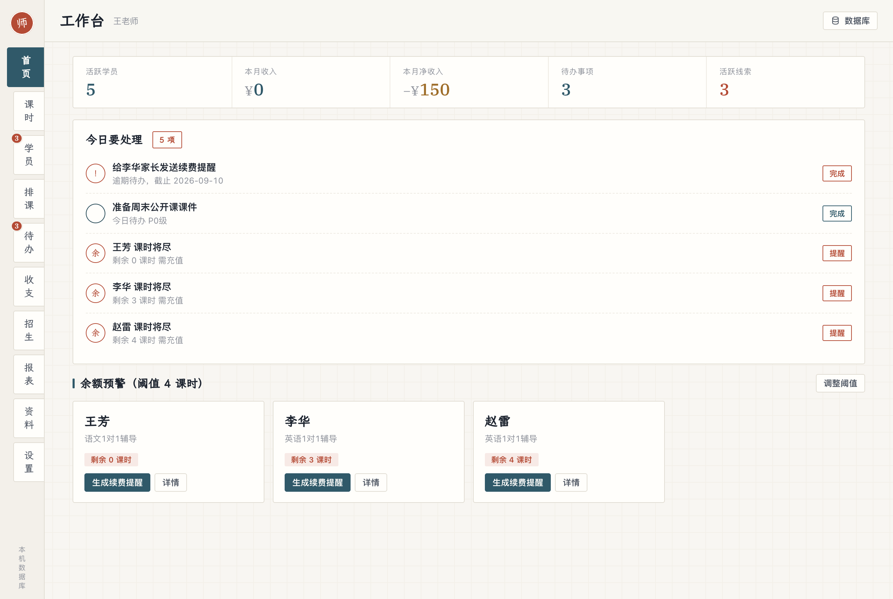
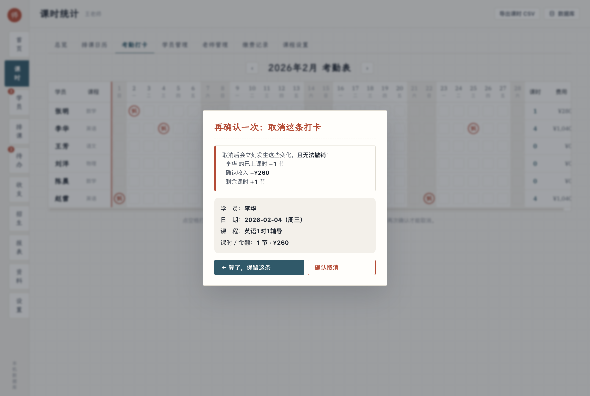

# 独立老师工作台 · Tutor Workspace

给 1 对 1 辅导老师用的桌面工作台：课时、考勤、缴费、排课、收支、招生，数据存在**本机 SQLite**，不上传任何服务器。

A local-first desktop workspace for independent tutors: lesson hours, attendance, payments, scheduling, finance and lead tracking. All data lives in a SQLite file on your own machine. Chinese UI.

<p align="center"></p>

---

## 它解决什么

做 1 对 1 辅导的老师都懂：学员一多，课时算不清、收入记不住、谁快上完了全靠脑子记。这个工作台把这些事放进一本"电子点名册"里：

- **考勤打卡**：按日期盖章，一天可多条，自动算已上课时和确认收入
- **打卡锁定**：盖了章的格子不能随手改，取消要二次确认，每次打卡 / 取消都进审计流水
- **课时余额预警**：快用完的学员自动标出，一键生成续费提醒话术
- **缴费、排课、待办、收支、招生看板、家长分享页、运营报表**

## 为什么数据不会丢

| | 存哪 | 怎么保 |
|---|---|---|
| 桌面 App | `~/Library/Application Support/独立老师工作台/data/工作台.db`（Windows 在 `%APPDATA%`） | 事务写入、每小时自动快照（留 30 份）、一键备份 / 回滚 |
| 浏览器单文件版 | localStorage，可绑定本地 JSON 文件 | 手动导出备份 |

数据库是标准 SQLite 文件，任何工具都能打开；考勤审计表 `attendance_log` 只增不删。

---

## 视觉：一本摊开的点名册

<p align="center">


</p>

- 左侧**书脊索引标签**，竖排中文
- 学员名用**楷体**（课本字），数字用 **IBM Plex Serif** 等宽数字，货币符号比数值淡一档，负数写 `−¥150`
- 打卡是盖一枚微歪的**「到」字朱印**；取消是红笔划掉
- 三个色相：纸/墨、青 `#1E5A6B`、朱 `#C2412C`

三套主题在「设置 → 外观」切换，加一个紧凑密度开关：

<p align="center">


</p>

| `data-theme` | 名字 | 特点 |
|---|---|---|
| `ledger`（默认） | 点名册 | 纸本、楷体、朱印 |
| `slate` | 夜读 | 深色、金印 |
| `clean` | 明亮 | 白底、墨绿、无衬线 |

要加第四套，在 `src/index.html` 的 `<style>` 顶部照 `:root[data-theme="slate"]` 那块写一段 token 即可，骨架不用动。四个候选方向的对比稿在 [`docs/ui-directions.html`](docs/ui-directions.html)。

---

## 运行

```bash
npm install
npm start
```

`npm start` 会先把 `src/index.html` 同步进 `renderer/`（并把字体链接改成本地），再启动 Electron。第一次会自动下载两套字体到 `renderer/fonts/`（约 20MB，已 gitignore）。

| 命令 | 作用 |
|---|---|
| `npm test` | 数据层往返测试（22 项，纯 Node，秒出） |
| `npm run test:e2e` | 真启动 App、在界面上点、再回数据库查（13 项） |
| `npm run pack` | 只打包不做安装包，产物在 `dist/` |
| `npm run build:mac` / `build:win` | 出 `.dmg` / `.exe` |

**浏览器版**：直接用 Chrome / Edge 打开 `src/index.html` 也能用，走 localStorage，字体走 CDN。同一份文件，两种模式。

需要 Node ≥ 24（数据层用的是内置 `node:sqlite`，零 native 依赖）。

---

## 架构

```
src/index.html               ← 唯一真源：界面 + 全部业务逻辑（单文件，无框架）
        │  npm run sync
        ▼
renderer/index.html          ← App 的界面（字体链接改为本地）
        │  window.TWDB（contextBridge，页面拿不到 Node / 文件系统）
        ▼
electron/preload.js          ← 唯一的桥
        │  IPC
        ▼
electron/main.js             ← 窗口、菜单、备份、导入导出
        ▼
electron/db.js               ← SQLite：18 张表、事务、审计流水、快照
```

页面通过 `const APP = !!window.TWDB` 判断自己在 App 里还是浏览器里，只有 `loadS()` / `saveS()` 两个函数分流，其余 UI 代码不感知运行环境。

| 表 | 存什么 |
|---|---|
| `courses` / `students` / `student_courses` | 课程、学员、多对多 |
| `payments` / `attendance` / `attendance_log` | 缴费、考勤（带打卡时间戳）、**审计流水（只增不删）** |
| `teachers` / `schedules` | 老师、排课 |
| `todos` / `expenses` / `other_incomes` | 待办、支出、其他收入 |
| `leads` / `materials` / `referral_rewarded` | 招生线索、资料库、转介绍奖励 |
| `settings` / `meta` / `snapshots` | 设置、元信息、自动快照 |

---

## 发布

推一个 `v*` tag，GitHub Actions 会用 macOS 和 Windows 各自的机器打包，产物挂到 Release：

```bash
git tag v1.0.0 && git push origin v1.0.0
```

未签名的包在 macOS 上会被 Gatekeeper 拦（右键 → 打开），在 Windows 上会有 SmartScreen 提示。要消除需要 Apple Developer Program 和 Windows 代码签名证书；证书就位后把 `.github/workflows/build.yml` 里的 `CSC_IDENTITY_AUTO_DISCOVERY: false` 换成 `CSC_LINK` / `CSC_KEY_PASSWORD` secrets。

## 从浏览器版迁移

浏览器版右上角「数据」→「立即导出一份备份」得到 JSON，App 里菜单「数据」→「从 JSON 导入…」。导入前会自动存快照，导错了能回滚。

## 致谢

字体：[霞鹜文楷](https://github.com/lxgw/LxgwWenKai)（OFL）、[IBM Plex Serif](https://github.com/IBM/plex)（OFL）。

## License

MIT © 2026 Tim
